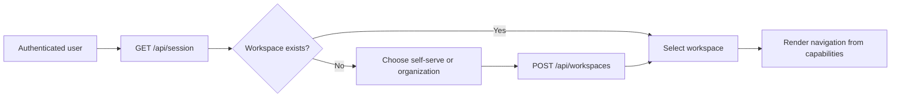
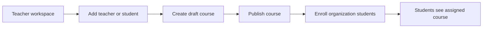
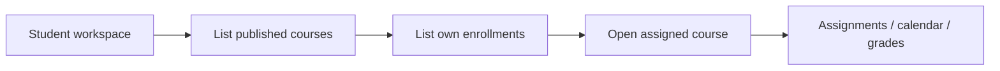
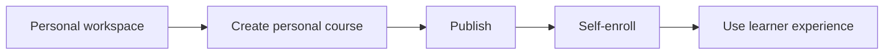

# ProofPath UI integration map

This is the contract between the LMS backend and the UI implementation. UI code may change layout, styling, components, and client state freely. It should not import `service.ts`, `repository.ts`, `server.ts`, or API route modules.

## Stable frontend boundary

UI code should import only:

```ts
import { createLmsApiClient, can, LmsApiError } from "@/features/lms/client";
import type { SessionResponse, WorkspaceAccess } from "@/features/lms/contracts";
```

Create one client after authentication resolves the actor:

```ts
const lms = createLmsApiClient({ actorId: sessionUserId });
```

The current `x-user-id` header is a local authentication seam. Replace it inside `createLmsApiClient` when real auth is selected; components should never construct this header themselves.

## Mode and role model

| Workspace mode | Valid role | Experience | Management rights |
| --- | --- | --- | --- |
| `self-serve` | `owner` | Personal workspace | Create/publish personal courses and self-enroll |
| `organization` | `teacher` | Instructor workspace | Manage members, courses, publishing, and enrollments |
| `organization` | `student` | Learner workspace | View assigned courses and only their own enrollments |

Render actions using `workspace.capabilities`, not role-name checks. For example:

```tsx
{can(workspace.capabilities, "course:create") && <CreateCourseButton />}
```

The backend still enforces every permission. Capabilities only keep the UI honest and avoid showing unusable controls.

## Feature-to-UI-to-API map

| Feature | Primary UI route/component | Read API | Write API | Who can write | Backend status |
| --- | --- | --- | --- | --- | --- |
| Current user and workspace switcher | Global application shell | `GET /api/session` | — | — | Ready |
| Workspace list | Onboarding / workspace switcher | `GET /api/workspaces` | `POST /api/workspaces` | Authenticated user | Ready |
| Organization people | `/people`, member table/dialog | `GET /api/workspaces/:workspaceId/members` | `POST /api/workspaces/:workspaceId/members` | Teacher | Ready |
| Course catalog | `/courses`, course grid | `GET /api/courses?workspaceId=…` | `POST /api/courses` | Teacher or self-serve owner | Ready |
| Course publishing | Course studio/header | Course list | `POST /api/courses/:courseId/publish` | Teacher or self-serve owner | Ready |
| Enrollment roster | Course people tab / learner course list | `GET /api/enrollments?workspaceId=…&courseId=…` | `POST /api/enrollments` | Teacher; owner may self-enroll | Ready |
| Dashboard summary | `/dashboard` | Compose session, courses, enrollments | — | — | Backend inputs ready; aggregation pending |
| Assignments | `/assignments` | Planned `/api/assignments` | Planned | Teacher authors; student submits | UI mock only |
| Calendar | `/calendar` | Planned `/api/events` | Planned | Teacher manages course events | UI mock only |
| Gradebook | `/grades` | Planned `/api/grades` | Planned | Teacher grades; student reads own | UI mock only |
| Inbox / announcements | `/inbox` | Planned `/api/messages` | Planned | Members within policy | UI mock only |
| Proprietary mastery loop | Isolated future feature | Separate future API | Separate future API | Policy TBD | Deferred |

## Application routes

| Route | Audience | Purpose | Current data source |
| --- | --- | --- | --- |
| `/` | Public | LMS marketing and entry | Static |
| `/dashboard` | All signed-in users | Summary and next actions | Static display data; API composition pending |
| `/courses` | All workspace members | Course catalog | Static display data; connect `listCourses` |
| `/assignments` | Teachers and students | Coursework queue | Static display data |
| `/calendar` | Teachers and students | Course schedule | Static display data |
| `/grades` | Teachers and students | Grade summary | Static display data |
| `/inbox` | Teachers and students | Course communication | Static display data |
| `/demo` | Internal only | Isolated mastery prototype | Deterministic local state |
| `/instructor/interventions` | Internal only | Isolated mastery prototype | Deterministic local state |

## UI state contract

Every API-backed surface must render these states without changing the API contract:

| State | UI behavior |
| --- | --- |
| Initial | Use a stable skeleton matching final layout; do not show zero counts prematurely |
| Success with data | Render from contract DTOs; preserve IDs as keys |
| Success empty | Explain what is empty and show an allowed next action from capabilities |
| `400 BAD_REQUEST` | Keep form values and map `details` to field-level recovery copy |
| `401 UNAUTHENTICATED` | Route to the future sign-in boundary |
| `403 FORBIDDEN` | Remove stale protected controls, explain access, and refresh session capabilities |
| `404 NOT_FOUND` | Show a scoped not-found state with a link back to the collection |
| `409 CONFLICT` | Keep the user in context and explain the duplicate or state collision |
| `500 INTERNAL_ERROR` | Show retry and support/report affordances; do not expose raw errors |

## Workflow maps

### Entry and workspace selection



### Organization teacher



### Organization student



### Self-serve owner



## Files the UI teammate owns

- `src/app/**/page.tsx`, except `src/app/api/**`
- `src/components/**`
- Presentational styles in `src/app/globals.css` or a replacement styling system
- Client-side loading, empty, error, modal, toast, and optimistic interaction states

## Files the UI teammate should treat as contracts

- `src/features/lms/client.ts`
- `src/features/lms/contracts.ts`
- `src/features/lms/capabilities.ts`
- `src/app/api/**`

Backend-only files must never enter a client bundle:

- `src/features/lms/service.ts`
- `src/features/lms/repository.ts`
- `src/features/lms/server.ts`

## Safe integration order

1. Load `session()` in the application shell and add a workspace switcher.
2. Drive navigation and buttons from the selected workspace's `capabilities`.
3. Replace course seed data with `listCourses(workspaceId)`.
4. Add organization people and roster screens with the member/enrollment methods.
5. Keep assignments, calendar, grades, and inbox on typed UI fixtures until their backend contracts land.
6. Do not connect the proprietary mastery routes to the standard LMS navigation yet.
